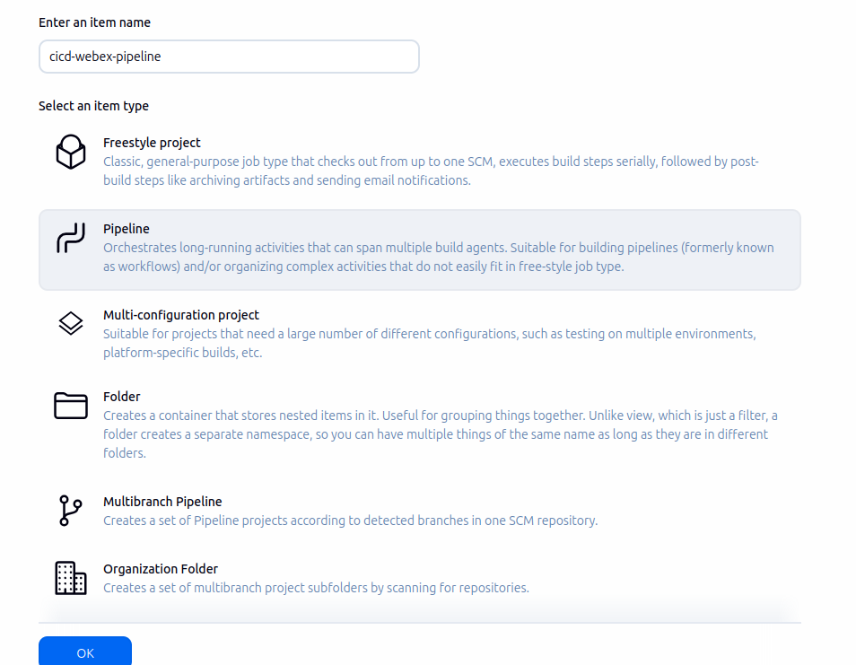
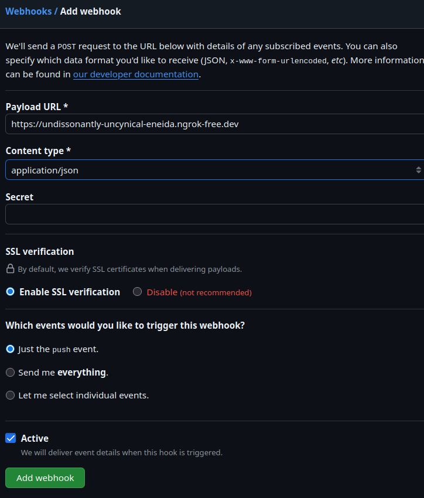

# cicd-webex

This project implements an automated CI/CD pipeline using Jenkins, GitHub webhooks, and WebEx notifications, demonstrating continuous integration principles from commit to deployment feedback.

---

## Requirements

- GitHub repository
- Docker installed
- Ngrok

---

## Docker setup (Linux / Mint OS)

Installation instructions adapted from the official [Docker documentation](https://docs.docker.com/engine/install/ubuntu/).

```bash
# Add Docker's official GPG key:
sudo apt-get update
sudo apt-get install ca-certificates curl
sudo install -m 0755 -d /etc/apt/keyrings
sudo curl -fsSL https://download.docker.com/linux/ubuntu/gpg -o /etc/apt/keyrings/docker.asc
sudo chmod a+r /etc/apt/keyrings/docker.asc

# Add the repository to Apt sources:
echo   "deb [arch=$(dpkg --print-architecture) signed-by=/etc/apt/keyrings/docker.asc] https://download.docker.com/linux/ubuntu   $(. /etc/os-release && echo "${UBUNTU_CODENAME:-$VERSION_CODENAME}") stable" |   sudo tee /etc/apt/sources.list.d/docker.list > /dev/null
sudo apt-get update

# Install Docker
sudo apt-get install docker-ce docker-ce-cli containerd.io docker-buildx-plugin docker-compose-plugin
```

To verify Docker is running:
```bash
sudo systemctl status docker
```

If it’s not running:
```bash
sudo systemctl start docker
```

Add your user to the Docker group to avoid using sudo:
```bash
sudo usermod -aG docker $USER
newgrp docker
```

---

## Ngrok setup

Download and install ngrok from [https://ngrok.com/download/linux](https://ngrok.com/download/linux)

```bash
curl -sSL https://ngrok-agent.s3.amazonaws.com/ngrok.asc   | sudo tee /etc/apt/trusted.gpg.d/ngrok.asc >/dev/null   && echo "deb https://ngrok-agent.s3.amazonaws.com bookworm main"   | sudo tee /etc/apt/sources.list.d/ngrok.list   && sudo apt update   && sudo apt install ngrok
```

Add your ngrok authtoken:
```bash
ngrok config add-authtoken <YOUR_AUTHTOKEN>
```

Start ngrok:
```bash
ngrok http 8080
```

You should see an output showing your public HTTPS URL forwarding to `localhost:8080`.

Example:
```
Forwarding  https://example-subdomain.ngrok-free.app -> http://localhost:8080
```

This URL will be used in your GitHub webhook setup.

---

## WebEx tokens setup

Create a `.env` file and add your WebEx bot credentials from [developer.webex.com](https://developer.webex.com):

```
WEBEX_BOT_TOKEN=your_bot_token_here
WEBEX_ROOM_ID=your_room_id_here
```

---

## Running Jenkins in Docker

Initial Jenkins setup:
```bash
sudo docker run -d --name jenkins   -p 8080:8080 -p 50000:50000   -v jenkins_home:/var/jenkins_home   -v $(pwd):/workspace   jenkins/jenkins:lts-jdk17
```

To restart Jenkins after a reboot:
```bash
docker start jenkins
```

Visit Jenkins at [http://localhost:8080](http://localhost:8080)

To retrieve the initial admin password:
```bash
sudo docker exec jenkins cat /var/jenkins_home/secrets/initialAdminPassword
```

Install the recommended plugins and create your local admin account (for example, user `anguzz`).

---

## Adding WebEx credentials in Jenkins

Navigate to:
```
Manage Jenkins → Credentials → System → Global credentials (unrestricted)
```

Add the following two credentials:

**1. WebEx Bot Token**
- Kind: Secret text
- Secret: `WEBEX_BOT_TOKEN` from your `.env`
- ID: `WEBEX_BOT_TOKEN`
- Description: WebEx Bot API Token

**2. WebEx Room ID**
- Kind: Secret text
- Secret: `WEBEX_ROOM_ID` from your `.env`
- ID: `WEBEX_ROOM_ID`
- Description: WebEx Room ID

---

## Creating the Jenkins CI/CD Pipeline

1. Go to Jenkins → New Item → Pipeline
2. Set the name: `cicd-webex-pipeline`
3. Select **Pipeline script from SCM**
4. SCM: Git
5. Repository URL: `https://github.com/anguzz/cicd-webex.git`
6. Branch: `*/main`
7. Script path: `Jenkinsfile`
8. Under **Build Triggers**, enable: `GitHub hook trigger for GITScm polling`
9. Save the pipeline configuration.



---

## GitHub Webhook setup

1. Go to your GitHub repository → Settings → Webhooks → Add Webhook
2. Fill in as follows:

| Field | Value |
|-------|--------|
| **Payload URL** | `https://<your-ngrok-subdomain>.ngrok-free.app/github-webhook/` |
| **Content type** | `application/json` |
| **Secret** | *(leave blank)* |
| **Event** | "Just the push event" |
| **Active** |  |




3. Save and confirm GitHub shows a **Response 200 OK** on the test ping.

---

## Quick CI/CD-WebEx Checklist

### Jenkins
- [ ] `docker ps` → Jenkins running on `:8080`
- [ ] Access `http://localhost:8080` → dashboard loads
- [ ] Job: **cicd-webex-pipeline**
- [ ] Pipeline configured for `https://github.com/anguzz/cicd-webex.git`
- [ ] Branch → `*/main`
- [ ] Trigger → GitHub hook trigger enabled
- [ ] Credentials → `WEBEX_BOT_TOKEN`, `WEBEX_ROOM_ID`

### Ngrok
- [ ] Run `ngrok http 8080`
- [ ] Confirm tunnel → `https://<subdomain>.ngrok-free.app -> http://localhost:8080`
- [ ] Open URL → Jenkins login visible

### GitHub Webhook
- [ ] Webhook configured for push events
- [ ] Payload URL → `https://<subdomain>.ngrok-free.app/github-webhook/`
- [ ] Response 200 OK confirmed

### WebEx
- [ ] Bot + room tokens in Jenkins credentials
- [ ] Bot sends success/failure message after Jenkins build

### Push + Watch
```bash
git add .
git commit -m "Trigger CI/CD test"
git push
```
- ngrok → shows POST from GitHub  
- Jenkins → auto-build starts  
- WebEx → notification posted

---

## Directory Structure

```
cicd-webex/
├── calculator.py
├── test_calculator.py
├── Jenkinsfile
├── requirements.txt
├── .envExample
├── README.md
└── project.txt
```
